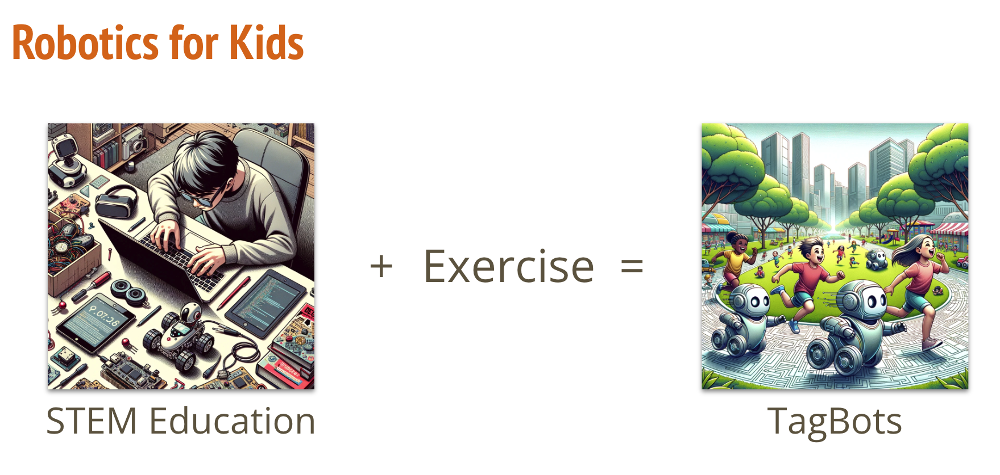
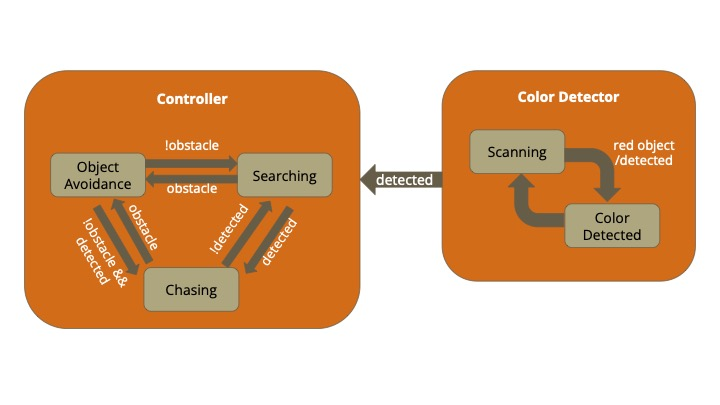
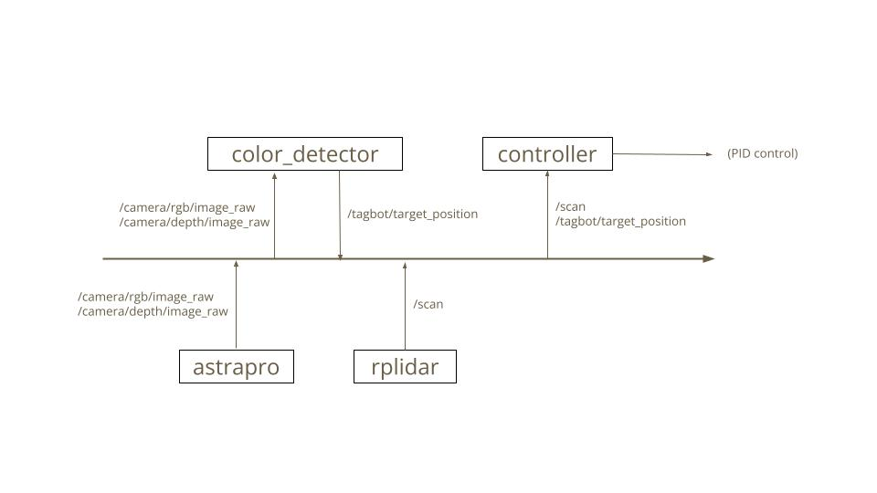
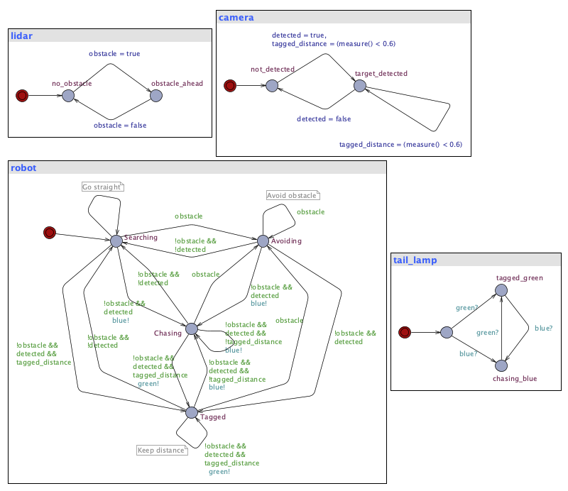

# EC545_TAGBOT
## TAGBOTS: Multiple robots chasing human players

Introducing "TagBot" – our innovative project where robotics meets fun and fitness. Unlike typical indoor robotics activities, Tagbot takes tech outdoors, encouraging kids to dive into STEM learning while staying active.

Our mission is to create robots that can play tag with kids. With Tagbot, children don't just learn science and tech; they move, strategize, and grow holistically.



## Requirements

### Hardware
* [Yahboom ROSMASTER X3](https://category.yahboom.net/products/rosmaster-x3)
  * Jetson Nano 4GB main control board
  * Astra Pro Plus RGB and Depth camera
  * 2D LiDAR
### Software
* Ubuntu 18.04 LTS
* ROS1 Melodic
* [Yahboom Tutorial Code](https://github.com/YahboomTechnology/ROSMASTERX3)
* Python environment

## How to Run
1. Clone this repository to your robot.
  ```
  git clone https://github.com/AidanNowa/EC545_TAGBOT.git
  ```
2. Register the TagBot workspace `tagbot_ws` and its packages to your ROS environment.
  ```
  source EC545_TAGBOT/tagbot_ws/devel/setup.bash
  ```
3. Run the TagBot.
  ```
  roslaunch controller controller.launch
  ```
  The `controller.launch` file automatically starts all the ROS nodes that are necessary to execute the entire TagBot system.
  
  You can also test the `color_detector` package alone with the following command:
  ```
  roslaunch color_detector color_detector.launch
  ```

## System Architecture
### Overview


We implemented two ROS packages to achieve the TagBot system: `color_detector` and `controller`. They depend on sensor packages provided by [Yahboom](https://github.com/YahboomTechnology/ROSMASTERX3), namely `astrapro` and `rplidar`.

### Color Detector
The `color_detector` looks for the closest object with a specified color  and returns its distance and angle with respect to the ego robot. The default target color is red. This node subscribes to two ROS topics: `/camera/rgb/image_raw` and `/camera/depth/image_raw`. First, it locates red contours in an RGB image. Small contours are ignored as a noise. Second, it extracts the depth of each contour in the corresponding depth image. Finally, it picks the contour with the closest distance and calculates the object angle with respect to the robot. The angle calculation is based on the camera's Field of View (FOV) specification. The distance and angle information is published as a ROS topic, `/tagbot/target_position`. It only publishes this information when objects are detected.

### Controller

#### Object Avoidance

The object avoidance block guides the robot to turn away from detected objects or walls. This block depends on a ROS topic for 2D LiDAR measurements, `/scan`. The LiDAR has front field of view (FOV) of 320 degrees, with 40 degrees of blind spot on behind. For simplicity, we devided the 320 FOV into 3 directions: left, front, and right. For each direction, it flags a warning when there are more than a certain number of point clouds within a threshold distance (0.6 meters). When warnings are present, the robot stops and rotates on the spot to turn away from the flagged directions. When all three directions are flagged, the robot backs up for 0.15 meters then rotates to a different direction.

#### Search

#### Chase


## Testing and Analysis
### Color Detector
* Accuracy
* The existing human detection models, such as Yolo, do not work well for our use case because the camera is placed close to the ground.
* Advantages
  * Realiable against blurring
  * Faster than neural network-based human detections
* Disadvantages
  * False-positives on red objects around the field
  * Hardware contraints
    * Narrow field of view of the camera (73 degrees)
    * Depth camera distance limitation (> 0.6 meters)

### Object Avoidance
* Capable of detecting and avoiding walls with high accuracy
* When it comes to relatively smaller objects, such as legs of chairs

### UPPAAL analysis

We analyzed the state transition with (https://uppaal.org/)



In the UPPAL robot diagram, a 'tagged' state indicates when the robot successfully tags a player within 0.6 meters. Transition between all states is possible except from the initial state. A hierarchical state machine with an upper layer for object avoidance is proposed for future clarity and safety.